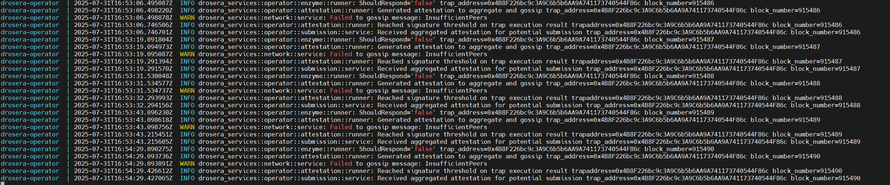
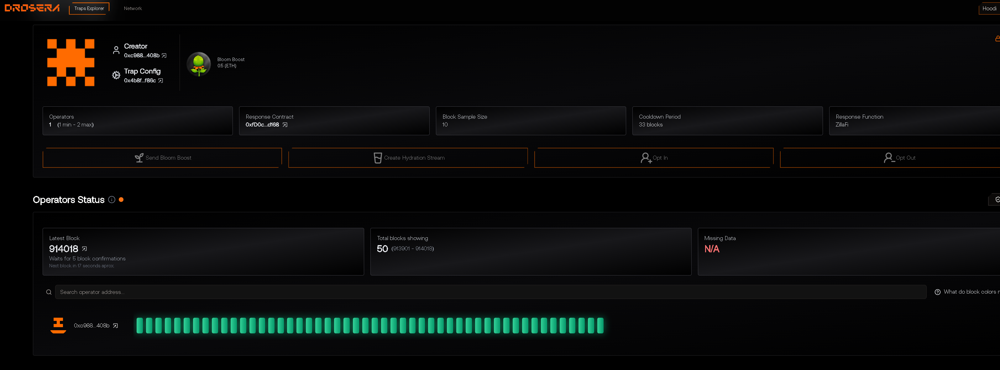

# 🧠 Drosera Operator for Hoodi Network

Операторская нода для обработки "ловушек" в сети **Drosera** на цепочке **Hoodi (Chain ID: 560048)**.  
Автоматически реагирует на события и генерирует **attestations** в рамках децентрализованного выполнения смарт-контрактов.

---

## ⚙️ Используемые адреса и параметры

- Ethereum RPC: `https://ethereum-hoodi-rpc.publicnode.com`
- Drosera RPC: `https://relay.hoodi.drosera.io`
- Chain ID: `560048`
- Trap address: `0x4B8F226bc9c3A9C6b5b6AA9A741173740544F86c`
- Whitelisted operator: `0xC988FC9a1195A391382EC8Ded0ac703cf022408b`

---

## 🚀 Быстрый старт

### 1. Клонировать репозиторий

```bash
git clone https://github.com/your-username/drosera-operator-hoodi.git
cd drosera-operator-hoodi
```

### 2. Настроить переменные окружения

Создайте `.env` файл или используйте переменные shell:

```env
OPERATOR_PRIVATE_KEY=your_private_key_without_0x
```

### 3. Запуск через Docker Compose

```bash
docker compose up --build
```

---

## 📄 Конфигурация ловушки (`drosera.toml`)

```toml
ethereum_rpc = "https://ethereum-hoodi-rpc.publicnode.com"
drosera_rpc = "https://relay.hoodi.drosera.io"
eth_chain_id = 560048
drosera_address = "0x91cB447BaFc6e0EA0F4Fe056F5a9b1F14bb06e5D"

[traps.mytrap]
path = "out/NeoMint.sol/NeoMint.json"
response_contract = "0xfD0c087ED4a7228cc194d224Ea25f05D593bd168"
response_function = "ZillaFi"
cooldown_period_blocks = 33
min_number_of_operators = 1
max_number_of_operators = 2
block_sample_size = 10
private_trap = true
whitelist = ["0xC988FC9a1195A391382EC8Ded0ac703cf022408b"]
address = "0x4B8F226bc9c3A9C6b5b6AA9A741173740544F86c"
```

---

## 🖼 Скриншоты

| Запуск | Успешный Attestation | Нет пиров |
|--------|----------------------|------------|
|  |  |  |

---

## 🛠 Полезные команды

- Просмотр логов:
  ```bash
  docker compose logs -f
  ```

- Перезапуск:
  ```bash
  docker compose down && docker compose up --build
  ```

---

## 📢 Примечания

- `ShouldRespond='false'` — означает, что нода **не должна выполнять реакцию**, но **всё ещё участвует** в генерации attestation.
- `InsufficientPeers` — означает отсутствие соседей по сети. Добавьте `bootnodes` при необходимости.

---

## 📜 Лицензия

MIT License. Используйте свободно, но с умом.
